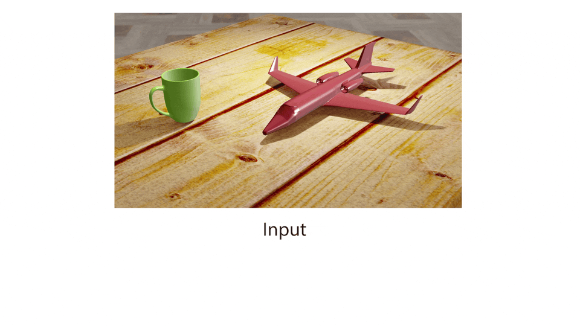

# Tree-Structured Shading Decomposition

### [Project Page](https://chen-geng.com/inv-shade-trees) | [Video](https://www.youtube.com/watch?v=L7zD9zM_zcg) | [Paper](https://chen-geng.com/files/inv-shade-trees.pdf) 



> [Tree-Structured Shading Decomposition](https://chen-geng.com/inv-shade-trees)
>
> Chen Geng\*, Hong-Xing Yu*, Sharon Zhang, Maneesh Agrawala, Jiajun Wu (* denotes equal contribution)
>
> Stanford University
>
> ICCV 2023

Implementation for the paper "Tree-Structured Shading Decomposition", which proposes a method to decompose a tree-structured representation for object shadings.

Citation: 
```
@inproceedings{inv-shade-trees,
              title={Tree-Structured Shading Decomposition},
              author={Chen Geng and Hong-Xing Yu and Sharon Zhang and Maneesh Agrawala and Jiajun Wu},
              booktitle={ICCV},
              year={2023}
              }
```
